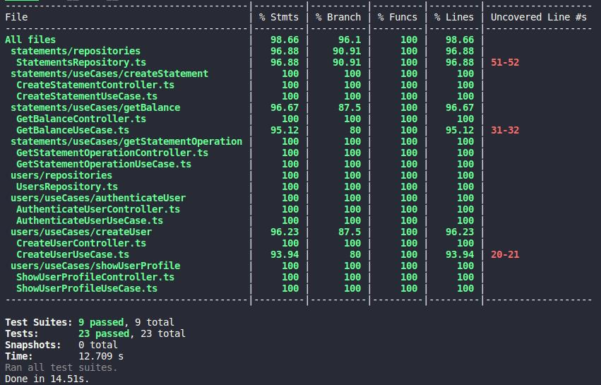

	

	<h1>Tests</h1>

### Summary

- [About the challenge](#about-the-challenge)

- [Final tests and coverage](#final-tests-and-coverage)

### About the challenge

- An application that is already developed without any tests and I have to create unit and integration tests to cover almost 100% of main files. [Click here](https://github.com/felipejsborges/ignite-challenge-nodejs-tests/commit/45a98d9a263ceecae253f6c10a044c9a7bcae562) to see the implementation of the unit tests. And [click here](https://github.com/felipejsborges/ignite-challenge-nodejs-tests/commit/d7c60c282182b1f0c59a475a9bea7b93c2bde3a8) to see the implementation of the unit tests

### Final tests and coverage

	
	

by Felipe Borges 
[LinkedIn](https://www.linkedin.com/in/felipejsborges) | [GitHub](https://github.com/felipejsborges)
