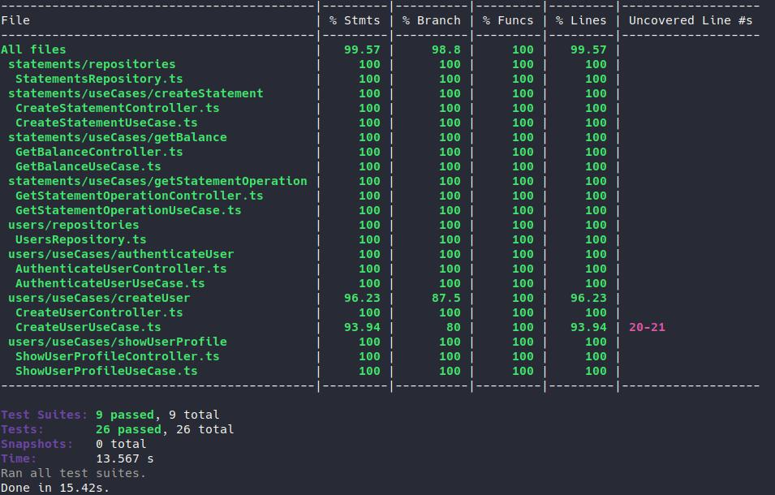

<div align="center">
	<a href="https://pages.rocketseat.com.br/ignite" target="_blank">
		
	</a>
</div>

<div align="center">
	<h1>Fin API</h1>
</div>

### Summary

- [About the challenge](#about-the-challenge)

- [Run local](#run-local)

- [Postman collection](#postman-collection)

- [Final tests and coverage](#final-tests-and-coverage)
<hr>

### About the challenge

An application that is already developed based on fintechs features, but without any tests. So I implemented:
- [Unit tests](https://github.com/felipejsborges/ignite-challenge-fin-api/commit/45a98d9a263ceecae253f6c10a044c9a7bcae562)
- [Integration tests](https://github.com/felipejsborges/ignite-challenge-fin-api/commit/d7c60c282182b1f0c59a475a9bea7b93c2bde3a8)
- [New feature: transfers between users](https://github.com/felipejsborges/ignite-challenge-fin-api/commit/42c8656db7763df42d37c0edbadb7235e122f7a3)
<hr>

### Run local

- Clone this repo

```bash
$ git clone https://github.com/felipejsborges/ignite-challenge-fin-api.git
```

- Install dependencies

```bash
# go to project folder
$ cd ignite-challenge-fin-api

# install dependencies using yarn
$ yarn
```

- Create docker instance for Postgres

```bash
$ docker run --name <some_name> -e POSTGRES_DB=fin_api -e POSTGRES_USER=postgres -e POSTGRES_PASSWORD=docker -d postgres
```

- Run migrations

```bash
$ yarn typeorm migration:run
```

- Run tests

```bash
$ yarn test
```

- Run server

```bash
$ yarn dev
```

### Postman collection
[](https://app.getpostman.com/run-collection/4a66a785e99339a117aa#?env%5Bdev%5D=W3sia2V5IjoiQkFTRV9VUkwiLCJ2YWx1ZSI6Imh0dHA6Ly9sb2NhbGhvc3Q6NTAwMS9wYXltZW50IiwiZW5hYmxlZCI6dHJ1ZX0seyJrZXkiOiJUT0tFTiIsInZhbHVlIjoiWW9zUUNyeEJFOFdvSE1XdDRrSnJBNGNVeE1TSFhxYTBkYjY0ZDEtY2IyYi00MGEzLWE5YTEtYjJiNmI0ODkzNjJkIiwiZW5hYmxlZCI6dHJ1ZX1d)

### Final tests and coverage
<div align="center" style="margin-top: 16px;">	
	
</div>
<hr>

by Felipe Borges<br>
[LinkedIn](https://www.linkedin.com/in/felipejsborges) | [GitHub](https://github.com/felipejsborges)
